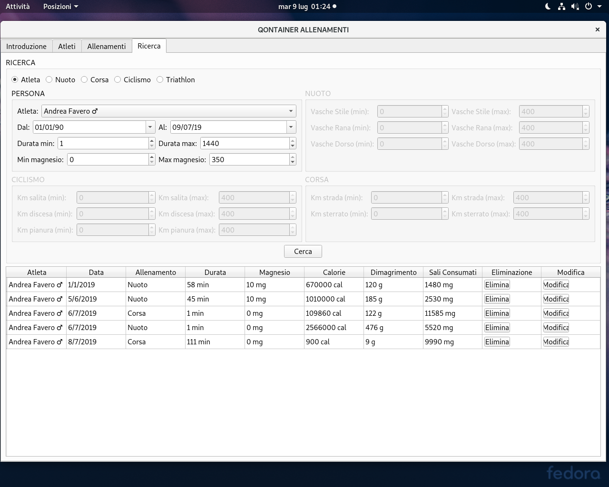

# QONTAINER

Progetto per il corso di Programmazione ad Oggetti (10 crediti Laurea in Informatica Università di Padova).



Icone create da vari autori su https://www.flaticon.com \
(Icons created by https://www.freepik.com/ authors on https://www.flaticon.com)

Per avere maggiori informazioni sui vincoli che il progetto deve rispettare leggere il file specificaProgettoAggiornata_2018-19.pdf

Per avere maggiori informazioni sulle scelte implementative del progetto leggere il file
```console
relazione/relazione.pdf
```
Per compilare dare i comandi

```console
qmake
make
```

Valutato ECCELLENTE dai correttori.
